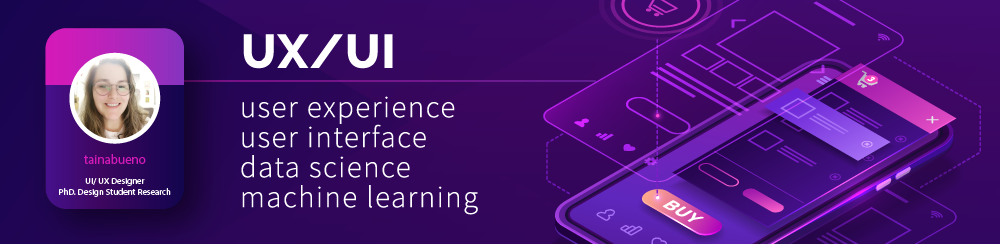

 
  

  

# Tainá Bueno
*UI/UX Designer* - Ph.D. student in Design and Media at PosDesign UFSC

Graduated in Design (2010) with a specialization in Design and Brand Management: Branding (2012). Master in Design - Methods for Human Factors/Ergonomics by PPGDesign from UDESC (State University of Santa Catarina) as a researcher/scholarship CAPES DS. Ph.D. student in Design and Media at PosDesign UFSC (Federal University of Santa Catarina) also as a researcher/scholarship CAPES DS.

In the market, I have experience in the area of ​​printed and digital visual programming, as well as UI & UX in mobile applications working in a technology company, advertising agencies, printed newspaper and university professor.

Participant in the Research Groups SCTIC - Structuring Research for Santa Catarina, TECMÍDIA and TECSAUDE. Areas of study: RFID [Radio Frequency Identification], Internet of Things, Hospital Management, Interaction Design, User Experience, IHC [Human-Computer Interaction].

**Background in:** UI/UX, Web and Mobile Apps Interface, Data Science and Machine Learning.

**Links:**
* [Blog](http://tainabueno.com)
* [LinkedIn](https://www.linkedin.com/in/tain%C3%A1-a-bueno-de-oliveira-856b62b8/)
* [Medium](https://www.medium.com/@tainabueno)

## Projetos:
Veja os tutoriais publicados do Sigmoidal:

* **Como usar o Histograma para Data Science:** https://bit.ly/2L2cMwy
* **Como Implementar Regressão Linear com Python:** https://bit.ly/2Li5pzY
* **Data Science: Investigando o naufrágio do Titanic:** https://bit.ly/2Ubr5SH
* **Como Tratar Dados Ausentes com Pandas:** https://bit.ly/31KWSMN
* **XGBoost: aprenda este algoritmo de Machine Learning em Python:** https://bit.ly/2UbRhws
* **Como criar uma Wordcloud em Python:** https://bit.ly/2OxsphM
* **Como lidar com dados desbalanceados:** https://bit.ly/2ZlaNsV

---

